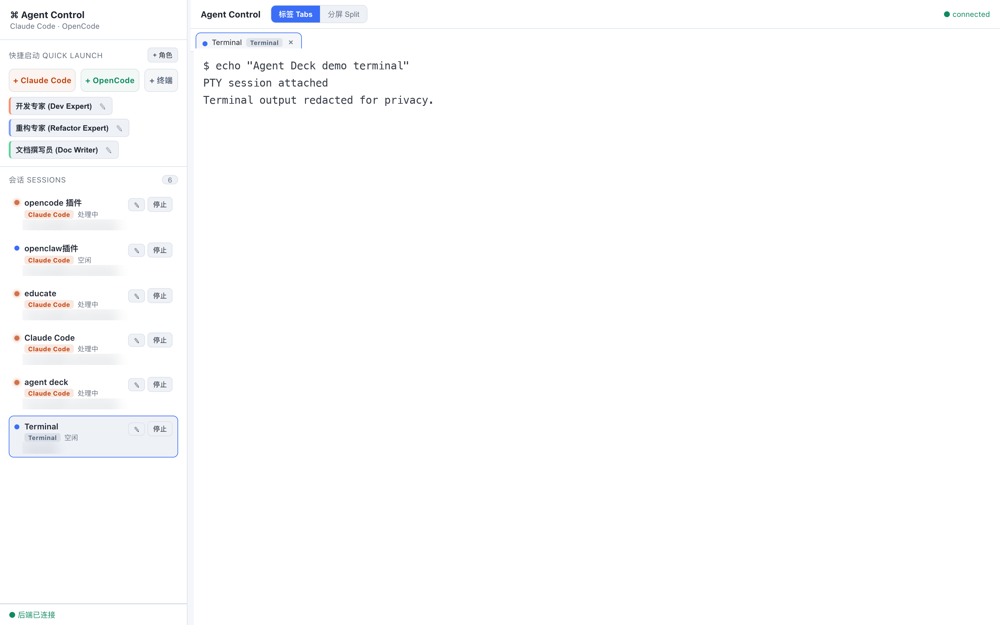
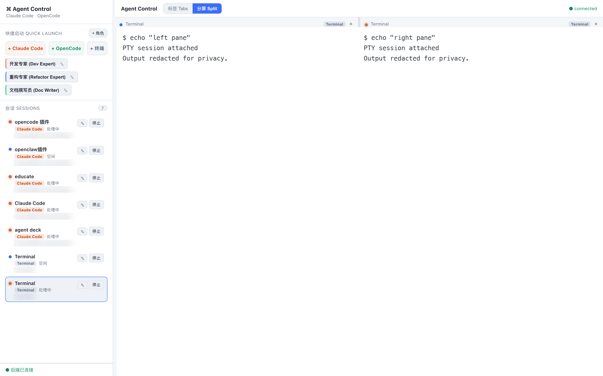
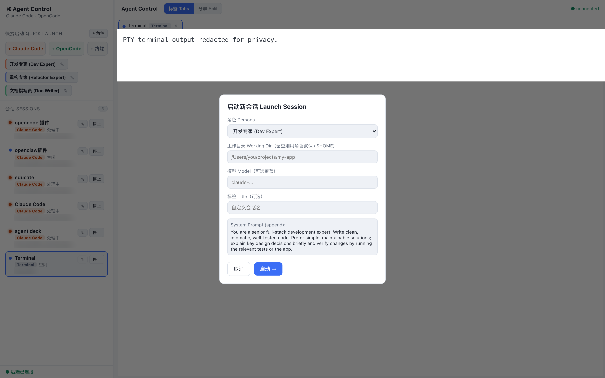

# Agent Deck

**English** | [简体中文](./README.zh-CN.md)

A local web dashboard for running multiple AI coding agent CLIs (`claude`, `opencode`, `openclaw`, `hermes`, `codex`) and plain shell terminals side by side. Real PTY terminals, sessions survive browser refreshes, one-click persona presets, tabs / split-pane layout.

## Screenshots

**Main dashboard (Tabs view)** — sidebar with quick launch, persona chips, and a live session board (status per session: running / busy / idle); the main area hosts a full PTY terminal:



**Split view** — run two sessions side by side; drag the divider to resize both terminals live:



**Launch dialog** — pick a persona, then optionally override working dir / model / title before starting the session:



## Install

**Requirements**

- macOS, Linux, or Windows 10 1809+ / Windows 11
- Node.js ≥ 18
- At least one supported agent CLI installed, logged in, and on your PATH: `claude`, `opencode`, `openclaw`, `hermes`, or `codex`. The dashboard detects which are present and only offers those.
- **Linux only:** a C/C++ toolchain for `node-pty` (`build-essential` + `python3`) — node-pty ships prebuilt binaries for macOS and Windows, but not Linux, so it compiles from source there. macOS needs `xcode-select --install` only if a build is triggered.

**Setup**

```bash
npm run setup
```

Installs `server/` and `web/` dependencies, repairs node-pty's `spawn-helper` executable bit where needed (macOS), and builds the frontend.

**Run**

```bash
# Production: single port serves UI + WebSocket
npm start                   # http://127.0.0.1:4173

# Dev: Vite HMR + backend hot reload
npm run dev                 # http://127.0.0.1:5173
```

All scripts are plain Node, so they run identically in bash, zsh, cmd.exe and PowerShell.

Environment variables: `PORT` (default 4173), `HOST` (default 127.0.0.1), `SCROLLBACK_BYTES`, `IDLE_AFTER_MS`, `CONTROL_APP_DATA` (directory for personas.json), `REAP_EXITED_AFTER_MS`.

## Uninstall

Nothing is installed globally — everything lives inside this directory.

Stop the server with Ctrl-C, then delete the directory. Persona data lives in
`data/personas.json` (or `$CONTROL_APP_DATA` / `%CONTROL_APP_DATA%` if set).

If a stray process is still holding the port:

```bash
# macOS / Linux
lsof -ti tcp:4173 -sTCP:LISTEN | xargs kill
```

```powershell
# Windows
netstat -ano | findstr :4173     # note the PID in the last column
taskkill /PID <pid> /F
```

## Features

- **Multiple CLI instances** — `xterm.js` + `node-pty` + WebSocket; full ANSI color and interactive TUI support.
- **Session persistence** — PTYs are hosted by the backend with 1 MiB scrollback; refresh/disconnect, then re-attach and replay full history. (A backend restart ends sessions — see "Advanced".)
- **Personas** — save presets (system prompt, model, working dir, env vars, extra args) and launch them with one click.
- **Resume past conversations** — when starting a Claude Code session, pick a previous conversation for that directory from a dropdown (newest first, with a preview of the opening prompt); leave it blank for a fresh session. Resumed via `--fork-session`, so the original transcript is never rewritten.
- **Plain terminals** — open your own shell as a tab next to agent sessions (login shell on macOS/Linux, PowerShell or `cmd.exe` on Windows).
- **Session board** — live status per session (starting / running / busy / idle / exited); tabs or resizable split panes with live terminal resize.
- **Per-session workspace** — each session can target a different project directory.
- **Auto-detected CLIs** — Quick Launch shows a button per agent CLI actually installed (`claude` / `opencode` / `openclaw` / `hermes` / `codex`), resolved through your login shell's PATH so version-manager and `~/.local/bin` installs are found. Nothing you don't have is offered.
- **Cross-platform** — macOS, Linux and Windows. On POSIX the CLI runs via a login shell so your PATH is loaded; on Windows it is spawned directly with an argv array (no shell in the chain, so no command-line quoting to get wrong).

## Usage

1. **Quick Launch** (sidebar): one button per agent CLI detected on this machine, plus a persona chip for each preset and **+ 终端** for a plain shell tab. A CLI you don't have installed gets no button, so a launch can't fail at spawn time.
2. The launch dialog lets you override working dir / model / title, and pick a past conversation to resume (blank = new blank session).
3. Switch the main area between **Tabs** and **Split**; drag split handles to resize live.
4. Sidebar **停止** and the tab's **×** both terminate the CLI and close the tab. Exited sessions linger briefly, then are auto-reaped.
5. Refreshing the browser never interrupts sessions.

### Persona → CLI flag mapping

| Field | Claude Code | OpenCode | OpenClaw | Hermes | Codex |
|---|---|---|---|---|---|
| Working dir (cwd) | process cwd | process cwd (project dir) | process cwd | process cwd | process cwd |
| Model | `--model` | `--model provider/model` | — (set in OpenClaw config) | `-m` | `--model` |
| Agent | `--agent` | `--agent` | — | — | — |
| System prompt | `--append-system-prompt` | `--append-system-prompt` (ignored if unsupported) | — | — | — |
| Extra dirs (addDirs) | `--add-dir` (each) | — | — | — | `--add-dir` (each) |
| Env vars | injected into process env | injected into process env | injected | injected | injected |
| Extra args | appended verbatim | appended verbatim | appended verbatim | appended verbatim | appended verbatim |

Only Claude Code supports **resume** from the dashboard. Codex has its own `codex resume` picker over `~/.codex`, but that is a subcommand reading a store this dashboard doesn't parse, so the resume dropdown stays Claude-only rather than promising something it can't deliver.

Codex's sandbox and approval policy (`-s` / `--ask-for-approval`) are left to your `~/.codex/config.toml`; set them per-persona via **Extra Args** if you want to override them for a session.

Personas are stored in `data/personas.json`; three examples are seeded on first start.

Resume is deliberately *not* a persona field — it names one specific past conversation, so it is chosen per launch in the dialog and maps to `--resume <session-id> --fork-session` (Claude Code only). The dropdown reads Claude Code's own transcripts under `~/.claude/projects/` — `%USERPROFILE%\.claude\projects` on Windows (override with `CLAUDE_PROJECTS_DIR`, or `CLAUDE_CONFIG_DIR` to move the whole config dir) and lists up to `RESUME_LIST_LIMIT` (default 30) entries for the selected working directory.

## Troubleshooting: node-pty `posix_spawnp failed`

On some macOS + recent-npm combinations, node-pty's `spawn-helper` is installed non-executable, and `pty.spawn()` throws `Error: posix_spawnp failed`. `npm run setup` / `npm start` fix this automatically (`server/scripts/fix-node-pty.js`). Manual fix:

```bash
chmod +x server/node_modules/node-pty/prebuilds/<platform>/spawn-helper
```

This does not apply to Windows (ConPTY uses `conpty.dll`, and there is no executable bit) or to Linux (node-pty calls `forkpty(3)` directly and builds no helper).

### Windows: `claude` not found on PATH

The launcher resolves the executable itself, since there is no shell to apply `%PATHEXT%`. npm installs the CLI as `claude.cmd`; if the dashboard reports it missing, confirm `where claude` finds it, then restart the dashboard so it picks up the current PATH.

## Architecture

```
Browser (React + xterm.js)
  ├── REST  /api/*   ── CRUD for personas / sessions
  └── WS    /ws      ── attach / input / resize ↔ output / status / exit / sessions
        │
Node backend (Fastify + ws + node-pty)
  ├── httpRoutes ── personaStore (JSON persistence) ── launcher (persona → argv/env/cwd)
  └── wsBridge ──── SessionManager ── PtySession { node-pty child + 1MiB scrollback ring }
        │
   claude / opencode / openclaw / hermes / codex CLI, or a login shell
```

- **Persistence** — PTYs are children of the long-running backend, each with a scrollback buffer replayed on re-attach. A backend restart ends them (in-memory registry).
- **Launch (POSIX)** — `bash -lc 'exec <cli> …'`: the login shell loads your PATH, `exec` makes the PTY *become* the CLI so signals / resize pass straight through. All persona values are POSIX single-quoted. Plain terminals spawn `$SHELL -l`.
- **Launch (Windows)** — the CLI is spawned directly with an **argv array** and no shell; node-pty applies the Win32 `CommandLineToArgvW` escaping. POSIX quoting is not merely wrong there, it is a no-op, so building a command line would turn the quoting into an injection vector. The executable is resolved against `PATH`/`PATHEXT` by the launcher because nothing else in the chain would.
- **Working dir** — the working-dir field is free text and becomes the spawn cwd directly, with no shell to normalize it the way `cd` would, so it is canonicalized to its real on-disk spelling first. Windows accepts every variant of a path (`d:\proj`, `D:/proj`, a trailing `\`, wrong case), but agent CLIs key per-project state on the path *string*: launched as `d:\proj`, Claude Code treats an already-trusted `D:\proj` as a new folder and opens blocked on the trust prompt, where `@file` references cannot resolve.
- **Signals** — Windows has no POSIX signals and node-pty *throws* if given one, so `kill()` is called with no argument (closing the pseudoconsole) and the SIGTERM→SIGKILL escalation is POSIX-only.
- **Live resize** — `ResizeObserver` + `xterm-addon-fit` compute cols/rows and sync them to `node-pty` over WS `resize` frames.

## Advanced: surviving backend restarts

Wrap the launch command in a re-attachable multiplexer (requires `tmux` or `dtach`):

```js
// in launcher.js change commandLine to:
// exec tmux new-session -A -s deck_<id> "<original command>"
```

## Security notes

- Binds to `127.0.0.1` only, **no authentication** — this is a local developer tool. Anyone who can reach the port can run commands as you; if exposing over the network, put an authenticating reverse proxy in front.
- On POSIX, persona values are single-quoted before embedding in `bash -lc`; on Windows no command line is built at all (argv array), which removes that quoting surface entirely. Persona `env` filters keys that could execute code early — `BASH_ENV` / `ENV` / `BASH_FUNC_*` / `LD_*` / `DYLD_*` / `PROMPT_COMMAND`, plus the Windows redirectors `COMSPEC` / `PATHEXT` / `PSModulePath` — matched **case-insensitively**, since Windows env names are case-insensitive and `Bash_Env` would otherwise slip past. `extraArgs` remain operator-trusted input.
- Exited sessions are reaped after a grace period (`REAP_EXITED_AFTER_MS`, default 5 min); slow WebSocket clients trigger backpressure (the backend pauses reading from that PTY) instead of unbounded buffering.

## Repository layout

```
agent-deck/
├── package.json            # top-level scripts (setup / dev / build / start)
├── scripts/                # setup.mjs / start.mjs / dev.mjs (cross-platform Node)
├── docs/screenshots/       # README screenshots
├── data/personas.json      # persona presets (seeded on first start, git-ignored)
├── server/                 # backend (Fastify + ws + node-pty)
│   ├── src/{index,config,platform,launcher,claudeSessions,personaStore,PtySession,SessionManager,wsBridge,httpRoutes}.js
│   ├── test/                # cross-platform unit tests (fake process.platform)
│   └── scripts/fix-node-pty.js
└── web/                    # frontend (React + Vite + xterm.js)
    └── src/{App,Sidebar,TerminalGrid,TerminalView,LaunchDialog,PersonaEditor,wsClient,api}.jsx|js
```
