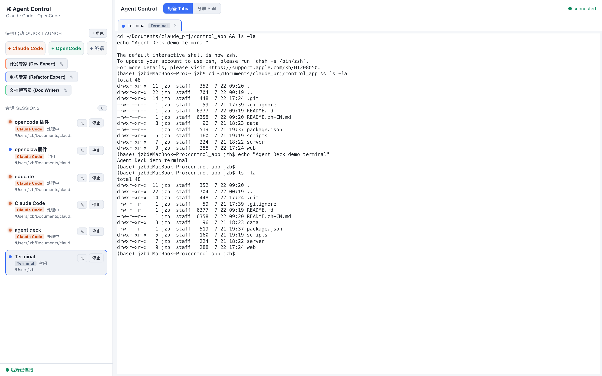
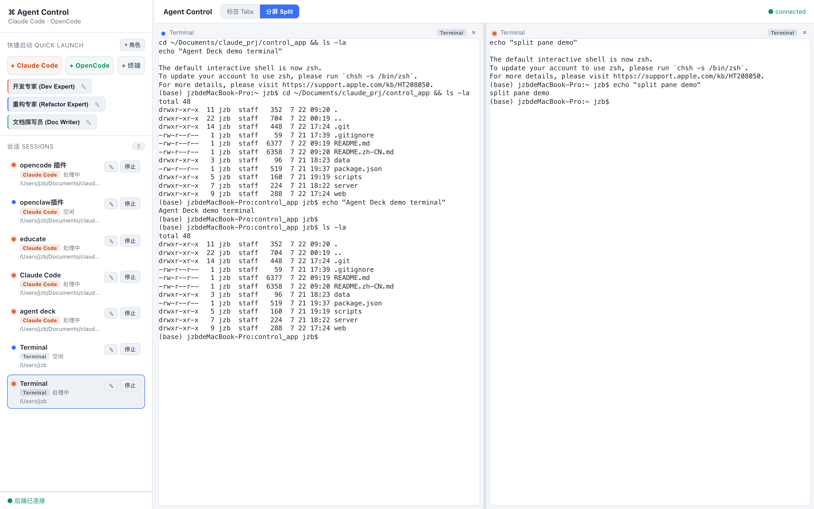
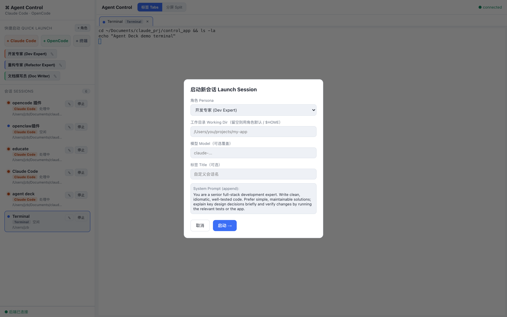

# Agent Deck

[English](./README.md) | **简体中文**

本地 Web 控制台，用于并排运行多个 AI 编码 Agent CLI（`claude` / `opencode`）和普通 shell 终端。真实 PTY 终端、刷新浏览器会话不丢、Persona 预设一键拉起、多标签 / 分屏布局。

## 界面预览

**主界面（标签视图）** — 左侧边栏包含快捷启动、Persona 预设 chip 和实时会话看板（每个会话显示运行中 / 处理中 / 空闲等状态）；主区域是完整的 PTY 终端：



**分屏视图** — 两个会话并排运行，拖拽分隔条可实时调整两侧终端尺寸：



**启动对话框** — 选择 Persona 后，可在启动前覆盖工作目录 / 模型 / 标题：



## 安装

**环境要求**

- macOS / Linux（Windows 请用 WSL）
- Node.js ≥ 18
- `node-pty` 需要 C/C++ 工具链（macOS：`xcode-select --install`；Linux：`build-essential` + `python3`）
- 已安装并登录 `claude` 和/或 `opencode` CLI，且在 PATH 中

**一键安装**

```bash
npm run setup
```

安装 `server/` 与 `web/` 依赖、修正 node-pty `spawn-helper` 可执行权限、构建前端。

**启动**

```bash
# 生产模式：单端口同时提供 UI 与 WebSocket
./scripts/start.sh          # http://127.0.0.1:4173

# 开发模式：Vite HMR + 后端热重载
npm run dev                 # http://127.0.0.1:5173
```

环境变量：`PORT`（默认 4173）、`HOST`（默认 127.0.0.1）、`SCROLLBACK_BYTES`、`IDLE_AFTER_MS`、`CONTROL_APP_DATA`（personas.json 存放目录）、`REAP_EXITED_AFTER_MS`。

## 卸载

不写入任何全局位置，所有内容都在本目录内。

```bash
# 停掉服务（Ctrl-C，或杀掉占用端口的进程）
lsof -ti tcp:4173 -sTCP:LISTEN | xargs kill

# 删除整个目录（角色数据在 data/personas.json，若设置过 $CONTROL_APP_DATA 则在该目录）
rm -rf /path/to/control_app
```

## 功能

- **多 CLI 实例** — `xterm.js` + `node-pty` + WebSocket，完整支持 ANSI 颜色与交互式 TUI。
- **会话持久化** — PTY 由后端长驻进程托管，保留 1 MiB 滚屏历史；刷新/断线后重新附着并回放完整历史。（后端重启会结束会话，见「进阶」。）
- **Persona 预设** — 保存系统提示词、模型、工作目录、环境变量、额外参数，快捷启动区一键拉起。
- **普通终端** — 「+ 终端」按钮打开登录 shell 页签，与 Agent 会话并排使用。
- **会话看板** — 侧边栏实时显示每个会话状态（启动中 / 运行中 / 处理中 / 空闲 / 已退出）；主区域支持标签或分屏，拖拽实时同步终端尺寸。
- **独立工作区** — 每个会话可指向不同项目目录。

## 使用

1. 侧边栏**快捷启动**：开裸 `claude` / `opencode` 会话、点角色 chip 按预设启动、或点 **+ 终端** 打开 shell 页签。
2. 启动对话框可覆盖工作目录 / 模型 / 标题。
3. 主区域顶部切换「标签 / 分屏」；分屏下拖拽分隔条实时调整尺寸。
4. 侧边栏「**停止**」与页签「**×**」效果相同：终止 CLI 并关闭页签。已退出会话短暂保留后自动回收。
5. 刷新浏览器不会中断会话。

### Persona → CLI 参数映射

| 字段 | Claude Code | OpenCode |
|---|---|---|
| 工作目录 cwd | 进程 cwd | 进程 cwd（project 目录）|
| 模型 model | `--model` | `--model provider/model` |
| Agent | `--agent` | `--agent` |
| System Prompt | `--append-system-prompt` | `--append-system-prompt`（不支持则忽略）|
| 额外目录 addDirs | `--add-dir`（每项）| — |
| 环境变量 env | 注入进程环境 | 注入进程环境 |
| 额外参数 extraArgs | 原样追加 | 原样追加 |

角色数据保存在 `data/personas.json`，首次启动自动写入三个示例。

## 排障：node-pty `posix_spawnp failed`

部分 macOS + 较新 npm 组合下，node-pty 的 `spawn-helper` 被安装为不可执行，导致 `pty.spawn()` 抛出 `Error: posix_spawnp failed`。`setup.sh` / `start.sh` 已自动修复（`server/scripts/fix-node-pty.js`）。手动修复：

```bash
chmod +x server/node_modules/node-pty/prebuilds/<platform>/spawn-helper
```

## 架构

```
浏览器 (React + xterm.js)
  ├── REST  /api/*   ── 角色/会话的增删改查
  └── WS    /ws      ── attach / input / resize ↔ output / status / exit / sessions
        │
Node 后端 (Fastify + ws + node-pty)
  ├── httpRoutes ── personaStore (JSON 持久化) ── launcher (persona → argv/env/cwd)
  └── wsBridge ──── SessionManager ── PtySession { node-pty 子进程 + 1MiB 滚屏环形缓冲 }
        │
   claude CLI / opencode CLI / 登录 shell
```

- **持久化** — PTY 是后端长驻进程的子进程，各自维护滚屏缓冲，重连时回放。后端重启会结束子进程（内存态注册表）。
- **启动方式** — `bash -lc 'exec <cli> …'`：登录 shell 加载用户 PATH，`exec` 让 PTY 直接变成 CLI 本身，信号 / 尺寸原样透传。所有 persona 值经 POSIX 单引号转义。普通终端直接拉起 `$SHELL -l`。
- **实时尺寸同步** — `ResizeObserver` + `xterm-addon-fit` 计算 cols/rows，经 WS `resize` 帧同步给 `node-pty`。

## 进阶：跨后端重启存活

把启动命令包一层可复用的多路复用器（需安装 `tmux` 或 `dtach`）：

```js
// launcher.js 中把 commandLine 改为：
// exec tmux new-session -A -s deck_<id> "<原命令>"
```

## 安全说明

- 仅绑定 `127.0.0.1`，**无鉴权** —— 这是本地开发者工具。任何能访问该端口的人都能以你的身份执行命令；如需网络暴露，请在前面加带认证的反向代理。
- persona 值经 POSIX 单引号转义后再拼进 `bash -lc`；persona 的 `env` 会过滤能提前执行代码的危险键（`BASH_ENV` / `ENV` / `BASH_FUNC_*` / `LD_PRELOAD` / `DYLD_*` / `PROMPT_COMMAND`）。`extraArgs` 属操作者可信输入。
- 已退出会话在宽限期后自动回收（`REAP_EXITED_AFTER_MS`，默认 5 分钟）；慢 WebSocket 客户端触发背压（后端暂停读取对应 PTY），不做无限缓冲。

## 目录结构

```
agent-deck/
├── package.json            # 顶层脚本 (setup / dev / build / start)
├── scripts/                # setup.sh / start.sh / dev.sh
├── docs/screenshots/       # README 截图
├── data/personas.json      # 角色预设（首启自动生成，不入库）
├── server/                 # 后端 (Fastify + ws + node-pty)
│   ├── src/{index,config,launcher,personaStore,PtySession,SessionManager,wsBridge,httpRoutes}.js
│   └── scripts/fix-node-pty.js
└── web/                    # 前端 (React + Vite + xterm.js)
    └── src/{App,Sidebar,TerminalGrid,TerminalView,LaunchDialog,PersonaEditor,wsClient,api}.jsx|js
```
